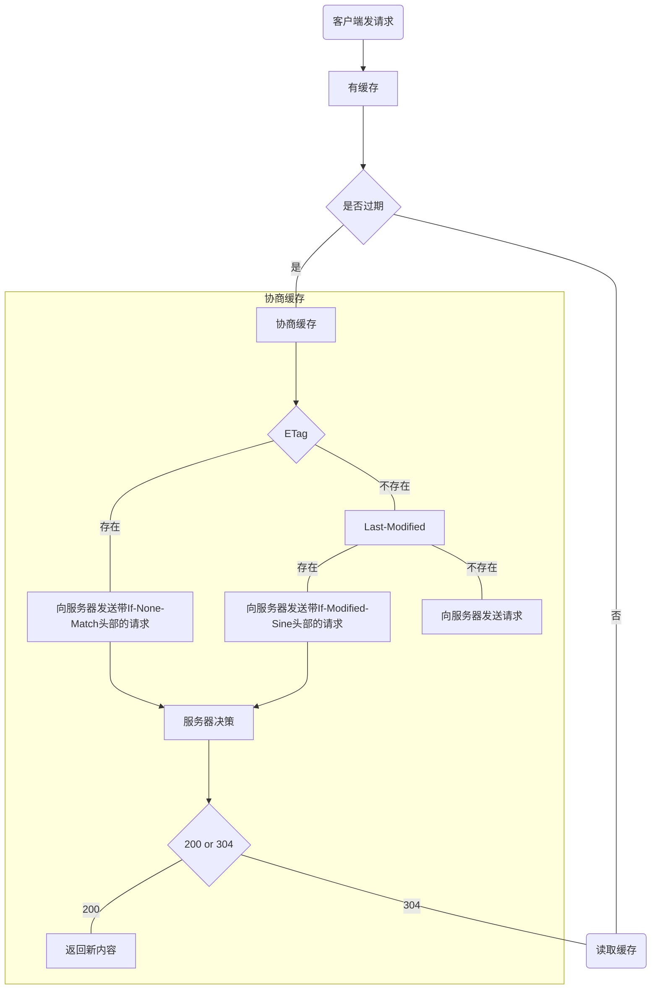
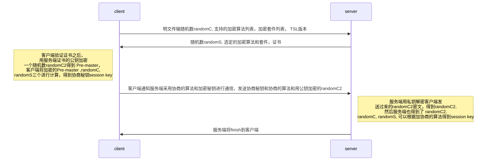

### 前言
http协议是基于tcp协议之上的应用层协议。当今被广泛的应用在互联网的各个领域，更是前端行业里最主要的通讯协议了，作为一个前端同学应该好好的了解下http的，无论是面试还是日常工作都是需要用到的。

### HTTP1.1
http1.1应该是目前应用最广泛的协议了，顺手打开几个网站，在控制台里看了下，目前基本都还是http1.1。http1.1是从http1.0发展而来，主要加入了新的缓存控制，Host和长链接，和其他的一些改进。http1.1的请求报文还是文本的格式，而且比较简单。http1.0没啥人用了，就不讲了。
#### HTTP协议报文格式
##### 请求报文格式
```http
请求方法  URL  协议版本   
头部字段名   值
....
头部字段名   值

请求体

// 例子

GET / HTTP/1.1
Host: www.baidu.com
Connection: keep-alive
Cache-Control: max-age=0

```
上面是一个请求报文的格式，第一行包含请求方法，请求路径和协议版本。第二行开始就是http请求的header字段了。如果有请求体，比如post的时候带了参数，这个参数就会在放在header的下面，并且和header之间隔一行。http有许多header，我们可以记一下常见的
|常见请求头|取值|作用|
|---|--|--|
|Host|域名|可以实现虚拟主机，也就是在一台服务器上部署多个网站|
|Connection| keep-alive/close|用来保持连接和关闭连接的， 1.1新加的请求头，保持连接的话就不用每次都去重新建立tcp连接，复用之前的链接，提高性能。| 
|Cache-Control|no-cache/max-age| 用来指定缓存的|
|Cookie|string| 传输cookie给服务器|
|Content-type|form-data|可以指定请求体的MIME类型|
|User-Agent| |浏览器身份|

除了一些常见的请求头之外，日常使用中还有一些自定义的头，比如authorization用于传递身份信息。在使用自定义头的时候，如果请求跨域了，使用了复杂请求的情况下，浏览器会自动发送一个预检请求（OPTIONS）。关于预检请求可参考后面的文档[预检请求参地址](https://developer.mozilla.org/zh-CN/docs/Web/HTTP/CORS#Preflighted_requests)。http响应报文和请求报文大致相同，第一行不一样。

##### 响应报文格式
```http
协议版本 状态码  状态描述   
头部字段名   值
....
头部字段名   值

响应体

// 例子

HTTP/1.1 200 OK
Cache-Control: no-cache
Connection: keep-alive
Content-Encoding: gzip
Content-Type: text/html;charset=utf-8
Coremonitorno: 0

```
响应头Set-Cookie可以往浏览器写cookie，请求的时候浏览器又自己带回去了，设置HttpOnly可以禁止js读取cookie，Cache-Control可以控制缓存的。
#### HTTP协议控制缓存
http的缓存控制是通过http头来实现的，缓存分两种，强缓存和协商缓存。强缓存不需要和服务器交互，协商缓存需要向服务器确认缓存是否可用。强缓存是由 Expires(http1.0)和max-age来实现，返回一个截止日期或者时间，告诉客户端在这段时间内是不用询问服务器的，直接使用本地缓存。先看下相关的缓存头。

1. Expires： 响应头，代表资源过期时间，由服务器返回提供，GMT格式日期，是http1.0的属性，在与max-age(http1.1)共存的情况下，优先级要低
2. Cache-Control
    - no-store: 所有内容都不缓存
    - no-cache: 有缓存，但是使用缓存前都需要向服务端确认缓存是否有效，过期不能用，必须确认
    - public: 可缓存， 整个链路上都可以缓存，（包括：发送请求的客户端，代理服务器，等等）
    - private: 只有客户端能缓存
    - max-age: 设置缓存存储的最大周期，超过这个时间缓存被认为过期(单位秒)。max-age=0的时候，可以走协商缓存，通常表现和no-cache一致，但是no-cache的缓存必须确认新鲜度之后才能使用，max-age可以不确认就使用 
    - s-maxage： 适用于代理服务器
    - max-stale： 表明客户端愿意接收一个已经过期的资源。可以设置一个可选的秒数，表示响应不能已经过时超过该给定的时间。及max-age + max-stale的时间为缓存时间
    - must-revalidate： 一旦资源过期（比如已经超过max-age），在成功向原始服务器验证之前，缓存不能用该资源响应后续请求。

> no-cache and max-age=0, must-revalidate indicates same meaning.
Clients can cache a resource but must revalidate each time before using it. This means HTTP request occurs each time though, it can skip downloading HTTP body if the content is valid. (来自[MDN](https://developer.mozilla.org/en-US/docs/Web/HTTP/Headers/Cache-Control))

在max-age没有过期的时候一般是直接从缓存里取的，不再发送请求,max-age过期和no-cache的情况下会向服务器验证缓存是否可用，也就是走协商缓存。
> chrome在部分情况下会忽略缓存，比如多次刷新同一个界面

协商缓存是由几个头部实现：`Last-Modified / If-Modified-Since` `Etag / If-None-Match`(优先级高于前者)


If-Modified-Since 是一个条件式请求首部，服务器只在所请求的资源在给定的日期时间之后对内容进行过修改的情况下才会将资源返回，状态码为 200  。如果请求的资源从那时起未经修改，那么返回一个不带有消息主体的  304  响应，而在 Last-Modified 首部中会带有上次修改时间。 不同于  If-Unmodified-Since, If-Modified-Since 只可以用在 GET 或 HEAD 请求中。

语法： If-Modified-Since: day-name, day month year hour:minute:second GMT

If-None-Match 是一个条件式请求首部。对于 GET 和 HEAD 请求方法来说，当且仅当服务器上没有任何资源的 ETag 属性值与这个首部中列出的相匹配的时候，服务器端会才返回所请求的资源，响应码为  200  。对于其他方法来说，当且仅当最终确认没有已存在的资源的  ETag 属性值与这个首部中所列出的相匹配的时候，才会对请求进行相应的处理。Etag 是服务器返回的一个值， 由服务器通过ETag头告诉浏览器。ETag语义上有两种，前面带`W/`字符的表示可以采用弱比较算法。



#### HTTP常用状态码
http的返回码也是比较重要的，前端后端甩锅排错全靠它了，虽然查一下就能查到错误码的意思，但是造火箭的时候还是要用到的，就简单收集下常见错误码吧。

HTTP协议状态码表示的意思主要分为五类 ,大体是:

- 1×× 　　保留
- 2×× 　　表示请求成功地接收
- 3×× 　　为完成请求客户需进一步细化请求
- 4×× 　　客户错误
- 5×× 　　服务器错误

|状态码|描述|作用|
|---|---|---|
|200|OK|指示客服端的请求已经成功收到，解析，接受。|
|201|Created|请求成功并且服务器创建了新的资源|
|202|Accepted|服务器已接受请求，但尚未处理。|
|204|No Content|服务器成功处理了请求，但没有返回任何内容(跨域OPTIONS请求可以返回这个)|
|301|Moved Permanently|请求的网页已永久移动到新位置， 永久重定向|
|302|Found|服务器目前从不同位置的网页响应请求，但请求者应继续使用原有位置来进行以后的请求。|
|304|Not Modified|文件没修改，缓存可用|
|400|Bad Request|服务器不理解请求的语法。|
|401|Unauthorized|需要进行身份验证|
|403|Forbidden|服务器接受请求，但是被拒绝处理。没权限|
|404|Not Found|服务器找不到请求的网页|
|405|Menthod Not Allowed|禁用请求中指定的方法|
|413|Request Entity Too Large|服务器无法处理请求，因为请求实体过大| 
|500|Internal Server Error|服务器遇到错误，无法完成请求。|
|502|Bad Gateway|服务器作为网关或代理，从上游服务器收到无效响应。|
|503|Service Unavailable|服务器目前无法使用|
|504|Gateway timeout|服务器作为网关或代理，但是没有及时从上游服务器收到请求|

#### SSL
http在传输的时候是明文的，安全和隐私得不到保证，所以在tcp上层引入一个ssl来加密数据，在传输的过程中就能够保证数据不被窃取了。传输的时候由http把报文传给SSL，SSL加密之后再传给TCP进行传输，接收端过程是反过来的。

>加密套件： 认证算法 加密算法 消息认证码算法 简称MAC 密钥交换算法 密钥衍生算法
1. SSL四次握手建立连接

一次握手：

1：客户端以明文发送Client Hello报文开始。 报文中包含客户端支持的 SSL的指定版本、加密套件（Cipher Suite）列表，和一个客户端随机数randomC。
二次握手：

2：服务器可进行SSL通信时，会以Server Hello报文作为应答。并且返回选择的版本，加密套件以及随机数randomS。

3：之后服务器发送Certificate报文。报文中包含公开密钥证书。

4：最后服务器发送Server Hello Done报文通知客户端，最初阶段的SSL握手协商部分结束。

三次握手：

5：客户端以Client Key Exchange报文作为回应。客户端生成新的随机数randomC2，并且使用上面约定的算法和公钥加密得到Pre-master。

6：接着客户端继续发送Change Cipher Spec报文。 该报文会提示服务器，在此报文之后的通信会采用Pre-master密钥加密。

7：客户端发送 Finished报文。该报文包含连接至今全部报文的整体校验值。这次握手协商是否能够成功，要以服务器是否能够正确解密该报文作为判定标准。

四次握手：

8：服务端收到Pre-master之后私钥解密得到randomC2, 至此和客户端和服务端拥有相同的三个随机数，可以加密得到相同的秘钥。服务器同样发送Change Cipher Spec报文。

9：服务器同样发送Finished报文，握手结束，可以开始数据交换。

> 客户端会校验证书的有效期，网址，以及颁发机构，可以保证不被中间人攻击，因为中间人即使劫持了信息，也拿不到这个网址对应的CA证书。

### HTTP2.0
http1.1功能很完善了，但是性能不够极致，所以http2.0就来了，http2.0完全兼容1.1，但是性能有大幅的提升。

### HTTP3.0
