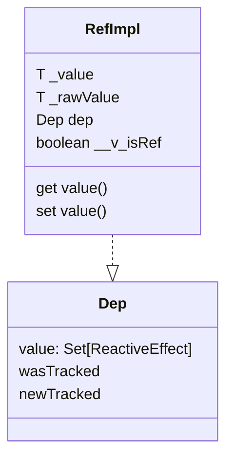

### ref
调用ref的时候，如果是非ref对象(根据 `__v_isRef`属性判断)的话，会创建一个`RefImpl`对象, 在构造函数里会接受一个值，然后调用`toReactive`来实现响应式， 在`get value()` 函数里进行依赖收集，`set`的时候进行依赖触发



### reactive
`reactive` 调用之后会给对象创建一个proxy代理对象，同时将代理对象缓存起来，proxy代理对象注册了`  get,set,deleteProperty,has,ownKeys` handles, 在set和get里还是老套路，get里收集依赖，set里触发依赖，get里`__v_raw`这个key会返回原始数据。
```ts
type Dep = Set<ReactiveEffect>
type KeyToDepMap = Map<any, Dep>
const targetMap = new WeakMap<any, KeyToDepMap>()
// 看着不方便,展开下
// targetMap: {
//     any: {
//         any: set[ReactiveEffect]
//     }
// }

```

component渲染的时候创建了effect

此时 effect 是全局的， 然后执行updateComponent的时候，会创建reactive对象，在getter里会track对象

track是将effect添加到target对应的key对应deps里， 然后setter的时候，trigger, 会触发target对应的key的effects，
effect执行前会先执行其options上的ioTrigger,和scheduler，最后执行其本身

